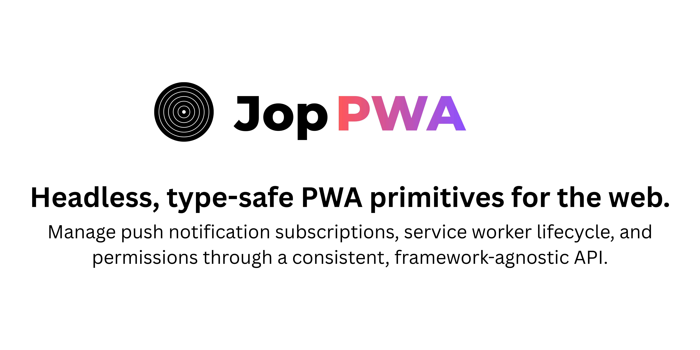

<div align="center">
  
</div>

<br />

<div align="center">
  <a href="https://npmjs.com/package/@jop/pwa-core">
    
  </a>
  <a href="https://github.com/jopgood/pwa">
    
  </a>
  <a href="https://bundlephobia.com/result?p=@jop/pwa-core">
    
  </a>
</div>

<br />

# Jop PWA

Headless, type-safe PWA primitives for the web. Manage push notification subscriptions, service worker lifecycle, and permissions through a consistent, framework-agnostic API.

- **Headless** — no UI, no opinions, just the primitives
- **Type-safe** — built in TypeScript with strict types throughout
- **Reactive state** — powered by [@tanstack/store](https://github.com/TanStack/store) for fine-grained updates
- **SSR-safe** — defers all browser work to `mount()`, works in Next.js and other SSR setups
- **Framework-agnostic** — use directly or pair with an adapter

## Packages

- [`@jop/pwa-core`](./packages/pwa-core) — framework-agnostic core
- [`@jop/react-pwa`](./packages/react-pwa) — React adapter with hooks and a provider

## Quick start

```ts
import { PWAManager } from '@jop/pwa-core'

const manager = new PWAManager({
  serviceWorkerUrl: '/sw.js',
  vapidPublicKey: 'YOUR_VAPID_PUBLIC_KEY',
  onSubscriptionChange: (subscription) => {
    // send subscription to your backend
  },
})

manager.mount()
manager.requestNotificationPermission()
manager.subscribe()
```

### With React

```tsx
import { PWAManager } from '@jop/pwa-core'
import { PushProvider, usePushNotifications } from '@jop/react-pwa'

const manager = new PWAManager({
  serviceWorkerUrl: '/sw.js',
  vapidPublicKey: 'YOUR_VAPID_PUBLIC_KEY',
})

function App() {
  return (
    <PushProvider manager={manager}>
      <PushDemo />
    </PushProvider>
  )
}

function PushDemo() {
  const { permission, isSubscribed, subscribe, requestPermission } = usePushNotifications()

  return (
    <div>
      <p>Permission: {permission}</p>
      <button onClick={requestPermission}>Request permission</button>
      <button onClick={subscribe} disabled={permission !== 'granted' || isSubscribed}>
        Subscribe
      </button>
    </div>
  )
}
```

## Examples

- [Vanilla TS](./examples/vanilla) — plain Vite + TypeScript
- [Next.js](./examples/nextjs) — Next.js App Router

## Get involved

- Issues and PRs are welcome
- [GitHub Discussions](https://github.com/jopgood/pwa/discussions)
- See [CONTRIBUTING.md](./CONTRIBUTING.md) for setup
